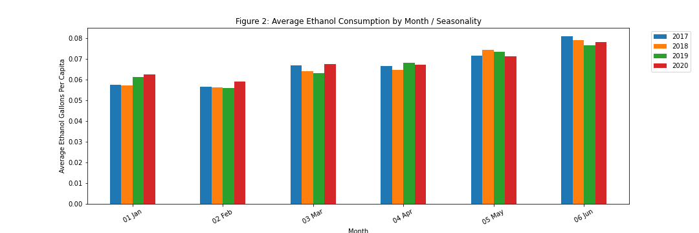

<!-- # data-clean-analyze-present -->

## **Did Alcohol Consumption Trends Change Due to COVID Infection Rates and Shutdowns?**

### **Group Project with:**
- [zach-18](https://github.com/zach-18)
- [regross527](https://github.com/regross527)
### **[New York Times: State by State COVID Shutdowns](https://www.nytimes.com/interactive/2020/us/states-reopen-map-coronavirus.html)**
* The article includes shutdown dates and durations
* National Shutdownn started March 13th, 2020

    

<!-- #### The COVID Tracking Project -->
### **[The COVID Tracking Project](https://covidtracking.com/data)**
* Almost all of the data compiled is taken directly from the websites of state/territory public health authorities. See the data sources page or flip to the “States” tab of the public spreadsheet, which includes constantly updated annotations about data-source changes.
* Data sources other than states/territories. Other trackers retrieve data directly from sources other than the state/territory public health authorities we use for the dataset. Many other trackers, including Johns Hopkins, USAFacts.org, and The New York Times, rely on county data rather than state data. While counties do report their data to the state, in practice the sum total of county data points can often differ from the totals the state reports, probably because the state normalizes county data to its own standards.
* Positive PCR tests (specimens):Total number of completed PCR tests (or specimens tested) that return positive as reported by the state or territory. If we discover that a jurisdiction is including antigen tests in this metric, we will annotate that state or territory’s data accordingly.
* Total PCR tests (people): Total number of unique people tested at least once via PCR testing, as reported by the state or territory. The count for this metric is incremented up only the first time an individual person is tested and their result is reported. Future tests of the same person will not be added to this count. For states with ambiguous annotations, we have assigned their total tests to this category. In the case where the state only provides negative cases, this field is calculated as the summation of people who tested positive (“Positive Cases (People”) and the number of people who tested negative (“Negative (People or Cases)”). If we discover that a jurisdiction is including antigen tests in this metric, we will annotate that state or territory’s data accordingly.

### **[NIH Alcohol Consumption Data](https://pubs.niaaa.nih.gov/publications/surveillance-covid-19/COVSALES.htm)**

* The data includes only sixteeen (16) states (so far) and four (4) months: March, April, May and June 2020. 
* The data tracks per capita (percentage of population) of alcohol sales during the COVID-19 pandemic.
* The data comes from various state sources that monitor sales, primarily for taxation purposes and does not differentiate between on/off premises. 
* The sales data is converted to gallons of ethanol (pure alcohol) and divided by each state's population of people ages 14 and older to obtain "per capita ethanol estimates" that can be compared across states, beverage types and years. 

### **Question: What, if any, non-Pandemic year alcohol consumption rate changes occur with a given year? (i.e. Seasonality)**
* Alcohol consumption peaks during the summer, and then again, smaller, during the holiday season.
* Year over year, per capita  alcohol consumption spikes in June, and reaches its lowest point each February.

    
    
    
    

### **Question:Did alcohol consumption change in 2020/Pandemic months from the prior year? (i.e. sum)**
* January through March of 2020, we were on track for record high per capita consumption.  However, a significant change occurred starting in April.  By May and June of 2020 , Total Gallons per Capita were significantly lower than previous years.

    
    

### **Question: How did COVID shutdowns and infections rates affect alcohol consumption – if at all?**
* Consumption dropped in 2020 in nearly every state studied, sometimes by a large amount. Consumption in 2020 was only about 85% of what it was in previous years.

    
### **Question: Were alcohol consumption rates associated with infection rates? Or vice versa.**
* The low R-sq means there was not a correlation between the two factors.
```
r-squared is: 0.05457303978387858 
y = -43.58x + 56.19
```
    
 
